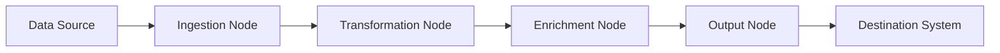

# How It Works

Ignate is designed around a simple but powerful idea: **data workflows**.  
A workflow defines _how data flows from source to destination_, including the transformations, checks, and actions applied along the way.

---

## Core Concepts

### 1. Data Sources

Data sources are the starting points of your workflows. Ignate supports databases, APIs, files, and streaming systems.

- Examples: PostgreSQL, MySQL, S3, Kafka, REST APIs
- Each source is configured once and can be reused across multiple workflows.

### 2. Nodes

Workflows are built from **nodes**. Each node represents a step in your data pipeline.

- **Ingestion Nodes**: pull data from sources.
- **Transformation Nodes**: filter, map, join, or aggregate data.
- **Enrichment Nodes**: add external context or machine learning predictions.
- **Output Nodes**: deliver data to warehouses, storage, or downstream systems.

Nodes are connected on the canvas to define the flow of data.

### 3. Triggers

Workflows can be started in different ways:

- **Manual Run**: start on demand.
- **Scheduled Run**: run at set intervals (e.g., hourly, daily).
- **Event-Based**: trigger when new data arrives or a condition is met.

### 4. Execution

When a workflow runs:

1. Data is fetched from the defined sources.
2. Each node processes the data in sequence or in parallel, depending on the workflow design.
3. Logs and metrics are generated in real time for full observability.
4. The processed data is delivered to the defined destinations.

### 5. Monitoring

Ignate provides detailed execution monitoring:

- Live logs and status updates
- Error tracking and debugging tools
- Performance metrics (latency, throughput, resource usage)

---

## End-to-End Flow

Here’s a simplified view of how Ignate workflows operate:

