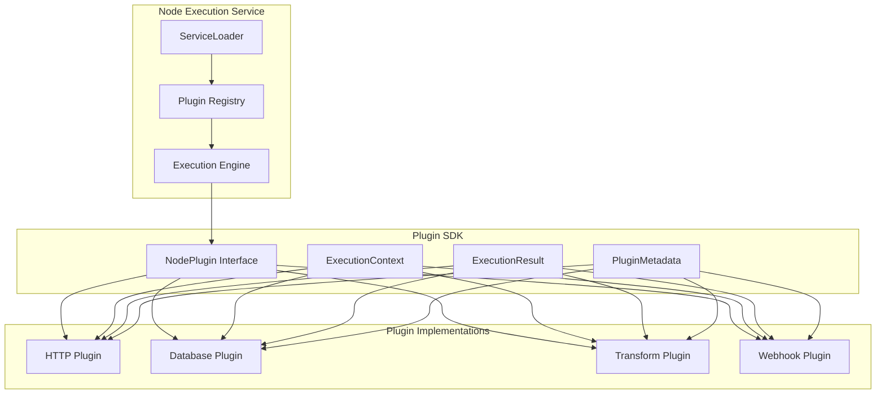
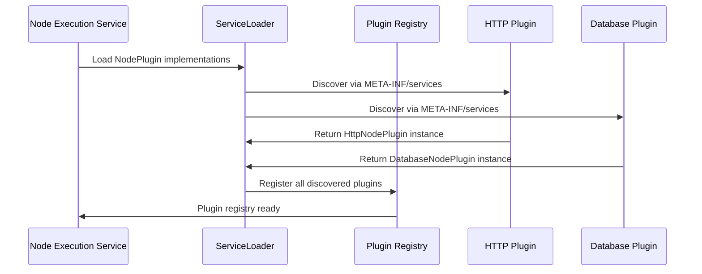

# 🔌 Node Plugin Architecture

This document provides a detailed overview of the plugin architecture for the No-Code API Flow Builder. The primary goal of this architecture is to enable flexible and scalable extension of the platform's capabilities by allowing new node types to be added without modifying the core execution engine.

## 🎯 Core Principles

- **🔄 Decoupling**: The core **Node Execution Service** is completely decoupled from the specific logic of individual nodes. It operates on a generic `NodePlugin` interface.
- **🚀 Extensibility**: New functionality can be added by creating a new plugin and deploying it as a self-contained module. No changes are needed in the core application.
- **🔍 Discoverability**: Plugins are discovered and loaded dynamically at runtime using Java's `ServiceLoader` mechanism. This avoids hard-coded dependencies and allows for a "drop-in" style of deployment.
- **🏗️ Isolation**: Each plugin is responsible for its own configuration, validation, and execution logic, ensuring a clear separation of concerns.

## 🧩 Plugin Architecture Overview



## ⚙️ Key Components

### 2.1. 🎭 The `NodePlugin` Interface

The `NodePlugin` interface is the central contract that all plugins must implement. It defines the standard lifecycle and behavior of a node.

```java
// Located in a shared SDK module, e.g., 'ignate-plugin-sdk'
package com.yourcompany.ignate.plugin;

import java.util.List;
import java.util.Map;

/**
 * The core interface for all executable nodes in the flow builder.
 * Implementations of this interface are discovered at runtime via Java's ServiceLoader.
 */
public interface NodePlugin {

    /**
     * Provides metadata about the plugin.
     * This metadata is used by the frontend to render the node in the editor,
     * build its configuration panel, and display descriptive information.
     *
     * @return A PluginMetadata object containing the node's identity and configuration schema.
     */
    PluginMetadata getMetadata();

    /**
     * Validates the configuration provided by the user for a specific node instance.
     * This method is typically called when a flow is saved to provide early feedback.
     *
     * @param configuration A map representing the JSON configuration from the UI.
     * @return A list of validation errors. An empty list signifies that the configuration is valid.
     */
    List<ValidationError> validate(Map<String, Object> configuration);

    /**
     * Executes the primary logic of the node.
     * This method is called by the Node Execution Service during a flow run.
     *
     * @param context The execution context, which provides all necessary data for the node
     *                to perform its function, including input from previous nodes and access to secrets.
     * @return An ExecutionResult, containing the output data and the execution status (SUCCESS or FAILURE).
     */
    ExecutionResult execute(ExecutionContext context);
}
```

### 2.2. 📋 `PluginMetadata` and Configuration

The `getMetadata()` method returns a `PluginMetadata` object, which tells the UI how to render the node and its settings form.

```java
public class PluginMetadata {
    private final String type; // A unique identifier, e.g., "HTTP_REQUEST"
    private final String displayName; // User-friendly name, e.g., "HTTP Request"
    private final String description;
    private final List<ConfigParameter> configSchema; // Defines the fields for the UI form

    // Constructor and getters
}

public class ConfigParameter {
    private final String key; // The name of the parameter
    private final String label; // The display label in the UI
    private final String type; // E.g., "text", "textarea", "select", "password", "code_editor"
    private final boolean required;
    private final List<String> options; // For "select" type
    
    // Constructor and getters
}
```

### 2.3. 🎯 The `ExecutionContext`

This class is a data carrier that provides a plugin with everything it needs to execute, acting as a sandbox to isolate the plugin from the core engine.

```java
public class ExecutionContext {
    private final UUID flowInstanceId;
    private final String nodeInstanceId;
    private final Map<String, Object> nodeConfiguration; // User-configured values for this specific node
    private final Map<String, Object> inputData;      // A map of outputs from the previous node(s)
    private final SecretsManager secretsManager;    // A service to securely fetch credentials (e.g., API keys)
    private final Logger logger;                    // A contextual logger for this node execution
    
    // Constructor and getters
}
```

**💡 Template Support**: The `inputData` can be populated with a templating engine like **Mustache** or **Freemarker** to allow users to dynamically reference outputs from previous nodes (e.g., `{{previous_node_id.output_key}}`).

### 2.4. 📤 The `ExecutionResult`

The `execute` method returns an `ExecutionResult`, which standardizes the output of every node.

```java
public class ExecutionResult {
    private final ExecutionStatus status; // SUCCESS or FAILURE
    private final Map<String, Object> outputData; // Data to be passed to the next node
    private final String errorMessage; // Null if status is SUCCESS
    
    public static ExecutionResult success(Map<String, Object> outputData) {
        // ...
    }

    public static ExecutionResult failure(String errorMessage) {
        // ...
    }
}
```

## 🔍 Plugin Discovery and Loading (`ServiceLoader`)

We use Java's built-in `ServiceLoader` to achieve true plug-and-play functionality.

### 📦 Plugin Loading Process



### 🛠️ Implementation Steps

1. **📦 Plugin Packaging**: Each plugin is packaged as a standard JAR file (e.g., `http-plugin-1.0.0.jar`, `database-plugin-1.0.0.jar`).

2. **📝 Service Declaration**: Inside each plugin's JAR, a special file must be created at the path: `META-INF/services/com.yourcompany.ignate.plugin.NodePlugin`.

3. **📄 File Content**: This file contains a single line: the fully qualified name of the class that implements the `NodePlugin` interface. For example, for the HTTP plugin:
   ```
   com.yourcompany.ignate.plugins.http.HttpNodePlugin
   ```

4. **🔄 Loading in the Node Execution Service**: When the service starts, it dynamically discovers all available plugins on its classpath:

   ```java
   import java.util.ServiceLoader;
   import java.util.Map;
   import java.util.function.Function;
   import java.util.stream.Collectors;

   public class PluginRegistry {
       private final Map<String, NodePlugin> plugins;

       public PluginRegistry() {
           this.plugins = loadPlugins();
       }

       private Map<String, NodePlugin> loadPlugins() {
           ServiceLoader<NodePlugin> loader = ServiceLoader.load(NodePlugin.class);
           return loader.stream()
               .map(ServiceLoader.Provider::get)
               .collect(Collectors.toMap(plugin -> plugin.getMetadata().getType(), Function.identity()));
       }

       public NodePlugin getPlugin(String type) {
           return plugins.get(type);
       }
   }
   ```

## 🚀 Deployment Workflow


### 📋 Step-by-Step Process

1. **🏗️ Project Setup**: A developer creates a new Maven/Gradle project for the plugin. This project depends on the `ignate-plugin-sdk` module (which contains the `NodePlugin` interface and data classes).

2. **💻 Implementation**: The developer implements the `NodePlugin` interface and writes the node's specific logic.

3. **📝 Service Declaration**: The developer adds the `META-INF/services/` file to declare the service.

4. **📦 Build**: The plugin is built into a JAR file.

5. **🚀 Deployment**: To deploy, the JAR file is simply copied into a `plugins` directory that is part of the **Node Execution Service's** classpath. When the service restarts, the new node type becomes automatically available.

## 🌟 Example: HTTP Plugin Implementation

Here's how a complete HTTP plugin would look:

```java
@Component
public class HttpNodePlugin implements NodePlugin {

    @Override
    public PluginMetadata getMetadata() {
        return PluginMetadata.builder()
            .type("HTTP_REQUEST")
            .displayName("HTTP Request")
            .description("Makes an outbound HTTP call to any REST API")
            .configSchema(List.of(
                ConfigParameter.builder()
                    .key("url")
                    .label("URL")
                    .type("text")
                    .required(true)
                    .build(),
                ConfigParameter.builder()
                    .key("method")
                    .label("HTTP Method")
                    .type("select")
                    .required(true)
                    .options(List.of("GET", "POST", "PUT", "DELETE"))
                    .build(),
                ConfigParameter.builder()
                    .key("headers")
                    .label("Headers")
                    .type("key_value_editor")
                    .required(false)
                    .build(),
                ConfigParameter.builder()
                    .key("body")
                    .label("Request Body")
                    .type("code_editor")
                    .required(false)
                    .build()
            ))
            .build();
    }

    @Override
    public List<ValidationError> validate(Map<String, Object> config) {
        List<ValidationError> errors = new ArrayList<>();
        
        String url = (String) config.get("url");
        if (url == null || url.trim().isEmpty()) {
            errors.add(new ValidationError("url", "URL is required"));
        } else if (!isValidUrl(url)) {
            errors.add(new ValidationError("url", "Invalid URL format"));
        }
        
        return errors;
    }

    @Override
    public ExecutionResult execute(ExecutionContext context) {
        try {
            Map<String, Object> config = context.getNodeConfiguration();
            String url = resolveTemplate((String) config.get("url"), context.getInputData());
            String method = (String) config.get("method");
            
            HttpResponse response = makeHttpRequest(url, method, config);
            
            Map<String, Object> output = Map.of(
                "statusCode", response.statusCode(),
                "body", parseResponseBody(response.body()),
                "headers", response.headers().map()
            );
            
            return ExecutionResult.success(output);
        } catch (Exception e) {
            context.getLogger().error("HTTP request failed", e);
            return ExecutionResult.failure("HTTP request failed: " + e.getMessage());
        }
    }
}
```

## ✨ Key Benefits

1. **🔧 Extensible**: A flexible plugin architecture allows for easy addition of new node types without touching core code.
2. **🚀 Scalable**: Plugins can be developed, tested, and deployed independently.
3. **🛡️ Resilient**: Plugin failures are isolated and don't affect the core system or other plugins.
4. **👥 Community-Driven**: Third-party developers can contribute new node types easily.
5. **🔒 Secure**: Plugins operate within a controlled execution context with limited access to system resources. 
