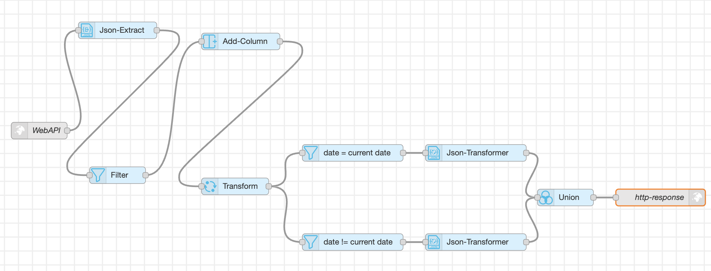

# 📄 Document: API Flow for Date Validation with Current Date

## Overview  
This workflow validates whether the **requested date** (passed as a query parameter in the API call) matches the **current system date**. The API response is structured as:

```json
{
  "isValid": true/false
}
```

## Workflow Diagram


---

## Node Details  

### 1. **Web API**  
- **Purpose:** Creates an API endpoint to receive requests.  
- **Endpoint Example:**  
  ```
  GET /checkDateCurrent?date=2025-08-19
  ```   
- **Input:** Query parameter `date` in the format `YYYY-MM-DD`.  
- **Output:** Forwards request payload to downstream processing.  

---

### 2. **Json-Extract**  
- **Purpose:** Extracts the requested date from the incoming query parameters.  
- **Configuration:**  

| Column            | Data Type | Output Column | JSON Query |
|-------------------|-----------|---------------|------------|
| originQueryParams | String    | date          | date       |

- **Example:**  
  Input → `{ "date": "2025-08-19" }`  
  Output → `date = "2025-08-19"`  

---

### 3. **Filter**  
- **Purpose:** Ensures only the `date` field moves forward in the workflow.  
- **Input:** Extracted query parameter.  
- **Output:** Passes along the requested `date` only.  

---

### 4. **Add-Column**  
- **Purpose:** Adds the **current timestamp** to the data flow for comparison.  
- **Configuration:**  

| New Column  | Operation   | Value                  | Data Type |
|-------------|-------------|------------------------|-----------|
| currentDate | Timestamp   | `Current_Timestamp()`  | DateTime  |

- **Example Output:**  
  ```
  requestedDate = "2025-08-19"
  currentDate   = "2025-08-19T07:05:51.064Z"
  ```

---

### 5. **Transform**  
- **Purpose:** Extracts only the `YYYY-MM-DD` part of the current timestamp for comparison.  
- **Configuration:**  

| Column      | Operation | Value  |
|-------------|-----------|--------|
| currentDate | SubString | 0, 10  |

- **Example Transformation:**  
  ```
  Input  → currentDate = "2025-08-19T07:05:51.064Z"
  Output → currentDate = "2025-08-19"
  ```

---

### 6. **Filter (date = current date)**  
- **Purpose:** Filters rows where the requested date is equal to the current system date.  
- **Understandable Name:** `date == current date`  

| Column | Operation | Value        |
|--------|-----------|--------------|
| date   | ==        | currentDate  |

- **Example:**  
  - Requested Date → `2025-08-19`  
  - Current Date   → `2025-08-19`  
  - ✅ Row success the equality check and passes into this filter branch. 


---

### 7. **Json-Transformer (for valid response)**  
- **Purpose:** Converts the comparison result into the final response format when dates match.  
- **Understandable Name:** `transform valid response`  
- **Configuration:**  

```json
{
  "isValid": true
}
```

---

### 8. **Filter (date != current date)**  
- **Purpose:** Filters rows where the requested date does not match the current system date.  
- **Understandable Name:** `date != current date`  


| Column | Operation | Value        |
|--------|-----------|--------------|
| date   | !=        | currentDate  |

- **Example:**  
  - Requested Date → `2025-08-18`  
  - Current Date   → `2025-08-19`  
  - ❌ Row fails the equality check and passes into this filter branch.  

---

### 9. **Json-Transformer (for invalid response)**  
- **Purpose:** Converts the comparison result into the final response format when dates don’t match.  
- **Understandable Name:** `transform invalid response`  
- **Configuration:**  

```json
{
  "isValid": false
}
```

---

### 10. **Union**  
- **Purpose:** Merges both branches (valid and invalid responses) into a single flow.  
- **Understandable Name:** `union results`  
- **Output:** Unified response payload for HTTP output.  

---

### 11. **HTTP-Response**  
- **Purpose:** Returns the final JSON response back to the client.  
- **Understandable Name:** `http-response`  
- **Example Responses:**  

✅ If the requested date **matches** the current date:  
```json
{
  "isValid": true
}
```

❌ If the requested date **does not match** the current date:  
```json
{
  "isValid": false
}
```
