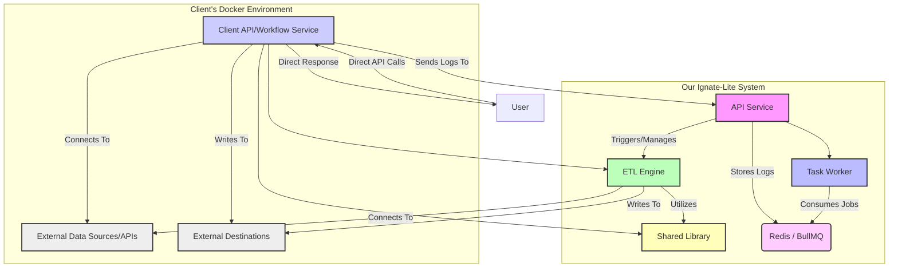

# Ignate Lite - Architectural Overview

This document provides a high-level architectural overview of the `ignate-lite` system, illustrating its core components and their interactions, with a particular focus on how external client-side workers can integrate.

## System Context Diagram

## Architectural Explanation

The `ignate-lite` system is designed as a modular, distributed backend platform primarily focused on data processing and API management. The architecture can support various deployment models, including a client-centric approach where core workflow execution occurs on the client's infrastructure.

### Core Components (Our System):

1.  **API Service**:
    *   Primarily acts as a log aggregation and management interface for client-side workflows.
    *   Manages internal `Task Workers` and `ETL Engine` for our own operations.

2.  **Redis / BullMQ**:
    *   Serves as the central message broker and job queueing system *for our internal operations*.
    *   Decouples internal job producers from job consumers.
    *   Ensures reliable job delivery and management (retries, dead-letter queues).

3.  **Task Worker (Our System)**:
    *   A dedicated service within our infrastructure that continuously consumes jobs from the internal Redis/BullMQ queue.
    *   Executes general-purpose background tasks and ETL workflows by leveraging the `ETL Engine` for our internal needs.

4.  **ETL Engine**:
    *   The core data processing component.
    *   Responsible for Extract, Transform, and Load (ETL) operations.
    *   Uses a Directed Acyclic Graph (DAG) to define and execute complex data flows.
    *   Connects to various `External Data Sources/APIs` (e.g., databases, external services) to extract data and writes to `External Destinations`. This component is also bundled with the client-side service.

5.  **Shared Library**:
    *   A collection of common utilities, interfaces, and connectors used across all `ignate-lite` packages.
    *   Promotes code reuse and consistency (e.g., logging, cryptography, database connectors). This component is also bundled with the client-side service.

### Client-Centric Workflow Execution with Client API/Workflow Service:

This architectural model emphasizes running the majority of the workflow logic directly on the client's Docker environment.

*   **Client API/Workflow Service**:
    *   Deployed within the client's Docker environment.
    *   **Directly receives API calls from users.**
    *   Upon receiving an API call, it performs all necessary operations, including ETL flows, using its bundled `ETL Engine` and `Shared Library` components.
    *   Connects directly to `External Data Sources/APIs` and writes to `External Destinations` within the client's network or other designated locations.
    *   Sends the direct response back to the originating `User`.
    *   Crucially, it is responsible for sending operational logs back to our `API Service` for centralized storage and monitoring.

*   **Communication Flow**:
    *   A `User` initiates an API call directly to the `Client API/Workflow Service` running in the client's Docker environment.
    *   The `Client API/Workflow Service` executes the entire workflow locally, interacting with client-side or external data sources/destinations as needed.
    *   The `Client API/Workflow Service` sends the final response directly back to the `User`.
    *   Concurrently, the `Client API/Workflow Service` sends operational logs back to our `API Service` for centralized collection and analysis.

This model provides maximum autonomy and data locality for the client, as the sensitive data processing occurs entirely within their controlled environment. Our platform primarily serves as a log aggregator and potentially a management interface, while the heavy lifting of specific workflows is offloaded to the client's infrastructure.
    *   The `Client API/Workflow Service` executes the entire workflow locally, interacting with client-side or external data sources/destinations as needed.
    *   The `Client API/Workflow Service` sends the final response directly back to the `User` (or back to our `API Service` if it's a synchronous proxy).
    *   Concurrently, the `Client API/Workflow Service` sends operational logs back to our `API Service` for centralized collection and analysis.

This model provides maximum autonomy and data locality for the client, as the sensitive data processing occurs entirely within their controlled environment. Our platform primarily serves as the initial entry point, a log aggregator, and potentially a management interface, while the heavy lifting of specific workflows is offloaded to the client's infrastructure.
