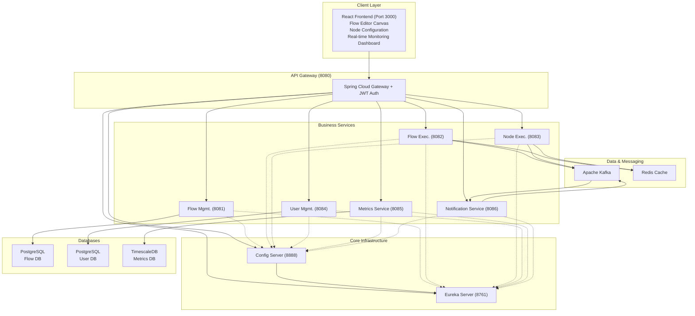
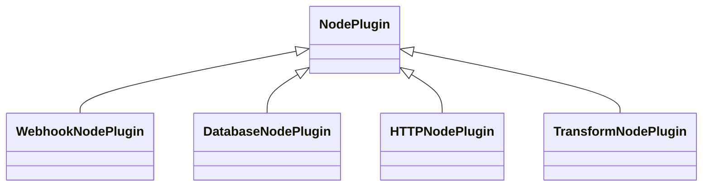

# 🚀 No-Code API Flow Builder - Architecture Overview

## 📝 Executive Summary

A microservices-based no-code API flow builder that enables visual workflow creation and execution. Built with Spring Boot, it provides a drag-and-drop flow design, real-time API generation, and comprehensive monitoring.

## 🗺️ System Architecture Diagram

## ⚙️ Core Services

### Infrastructure Layer
- **API Gateway (8080)**: Central entry point with authentication, rate limiting, and dynamic routing.
- **Eureka Server (8761)**: Handles service discovery and health monitoring for all microservices.
- **Config Server (8888)**: Provides centralized configuration management.

### Business Services
- **Flow Management (8081)**: Manages CRUD operations, versioning, and deployment of flows.
- **Flow Execution (8082)**: Orchestrates flow execution using Spring State Machine.
- **Node Execution (8083)**: Handles plugin-based processing for individual nodes (e.g., webhook, database, HTTP, transform).
- **User Management (8084)**: Manages JWT-based authentication, RBAC, and API key security.
- **Metrics Service (8085)**: Collects and serves real-time monitoring data to TimescaleDB.
- **Notification Service (8086)**: Pushes live updates to clients via WebSockets.

## 💻 Technology Stack
- **Core Framework**: Java 17, Spring Boot 3.2.0, Spring Cloud 2023.0.0
- **Databases**: PostgreSQL 15, TimescaleDB, Redis 7
- **Messaging**: Apache Kafka for asynchronous event-driven communication.
- **Deployment**: Docker, Kubernetes

## 🏛️ Key Architecture Decisions

### 1. Microservices Pattern
- **Decoupling**: Services are designed per domain with independent databases.
- **Communication**: Asynchronous communication via Kafka for high throughput and synchronous REST APIs through the gateway for direct calls.

### 2. Security
- **Authentication**: JWT-based authentication enforced at the gateway.
- **Protection**: Gateway-level rate limiting and method-level authorization.
- **Data Safety**: Sensitive data is encrypted at rest and in transit.

### 3. Scalability
- **Horizontal Scaling**: Stateless services are designed for easy horizontal scaling.
- **Performance**: Redis caching layer, database connection pooling, and circuit breakers (Resilience4j) ensure high performance and resilience.

### 4. 🔌 Node Plugin Architecture

The system uses a plugin-based architecture for node execution, making it easy to extend functionality.

## 🌊 Data Flow

1.  **Flow Creation**: A user designs a flow in the UI, which calls the API Gateway. The request is routed to the **Flow Management** service and persisted in the PostgreSQL database.
2.  **Flow Execution**: 
    - A trigger (e.g., webhook, schedule) initiates a flow in the **Flow Execution Service**.
    - A State Machine orchestrates the sequence of node executions.
    - Each node's logic is processed by the **Node Execution Service**.
    - Results are stored, and events are published to Kafka for other services to consume.
3.  **Real-time Updates**: Kafka events are consumed by the **Notification Service**, which pushes updates to connected clients via WebSockets.

## 📊 Monitoring & Observability
- **Metrics**: Micrometer is used with Prometheus for metrics collection and Grafana for visualization.
- **Tracing**: Distributed trace IDs are propagated across services for end-to-end tracing.
- **Logging**: Logs are structured in JSON format and aggregated in a central logging system (e.g., ELK stack).
- **Health Checks**: Each service exposes liveness and readiness probes for Kubernetes.

## 🚀 Deployment Strategy
- **Containerization**: All services are containerized using Docker.
- **Orchestration**: Kubernetes is used for orchestration, scaling, and management.
- **Configuration**: Kubernetes ConfigMaps manage environment-specific configurations.
- **Updates**: Rolling updates are used to achieve zero-downtime deployments. Blue-green deployment strategy is planned for production releases.

## 🎯 Performance Targets
- **API Response Time**: P95 < 500ms, P99 < 1s
- **Flow Execution Concurrency**: Supports 1000 concurrent executions.
- **System Availability**: 99.99% uptime.
- **Data Retention Policy**: Execution history is retained for 90 days.

## ✨ Key Benefits
1.  **Extensible**: A flexible plugin architecture allows for easy addition of new node types.
2.  **Scalable**: Services can be scaled horizontally and independently based on load.
3.  **Resilient**: Implements circuit breakers, retries, and fallback mechanisms to handle failures gracefully.
4.  **Observable**: Provides comprehensive monitoring, logging, and tracing across the entire system.
5.  **Secure**: A multi-layer security architecture protects the platform and its data.
