# 🔌 Node Plugin Architecture

This document provides a detailed overview of the plugin architecture for the No-Code API Flow Builder. The primary goal of this architecture is to enable flexible and scalable extension of the platform's capabilities by allowing new node types to be added without modifying the core execution engine.

## 🎯 Core Principles

- **🔄 Decoupling**: The core **Node Execution Service** is completely decoupled from the specific logic of individual nodes. It operates on a generic `NodePlugin` interface.
- **🚀 Extensibility**: New functionality can be added by creating a new plugin and deploying it as a self-contained module. No changes are needed in the core application.
- **🔍 Discoverability**: Plugins are discovered and loaded dynamically at runtime using Java's `ServiceLoader` mechanism. This avoids hard-coded dependencies and allows for a "drop-in" style of deployment.
- **🏗️ Isolation**: Each plugin is responsible for its own configuration, validation, and execution logic, ensuring a clear separation of concerns.

## 🧩 Plugin Architecture Overview

## ⚙️ Key Components

### 2.1. 🎭 The `NodePlugin` Interface

The `NodePlugin` interface is the central contract that all plugins must implement. It defines the standard lifecycle and behavior of a node.

### 2.2. 📋 `PluginMetadata` and Configuration

The `getMetadata()` method returns a `PluginMetadata` object, which tells the UI how to render the node and its settings form.

### 2.3. 🎯 The `ExecutionContext`

This class is a data carrier that provides a plugin with everything it needs to execute, acting as a sandbox to isolate the plugin from the core engine.

**💡 Template Support**: The `inputData` can be populated with a templating engine like **Mustache** or **Freemarker** to allow users to dynamically reference outputs from previous nodes (e.g., `{{previous_node_id.output_key}}`).

### 2.4. 📤 The `ExecutionResult`

The `execute` method returns an `ExecutionResult`, which standardizes the output of every node.

## 🔍 Plugin Discovery and Loading (`ServiceLoader`)

We use Java's built-in `ServiceLoader` to achieve true plug-and-play functionality.

### 📦 Plugin Loading Process

### 🛠️ Implementation Steps

1. **📦 Plugin Packaging**: Each plugin is packaged as a standard JAR file (e.g., `http-plugin-1.0.0.jar`, `database-plugin-1.0.0.jar`).

2. **📝 Service Declaration**: Inside each plugin's JAR, a special file must be created at the path: `META-INF/services/com.yourcompany.ignate.plugin.NodePlugin`.

3. **📄 File Content**: This file contains a single line: the fully qualified name of the class that implements the `NodePlugin` interface. For example, for the HTTP plugin:

4. **🔄 Loading in the Node Execution Service**: When the service starts, it dynamically discovers all available plugins on its classpath:

## 🚀 Deployment Workflow

```mermaid
graph LR
    A["🔨 Create Plugin Project"] --> B["📝 Implement NodePlugin"]
    B --> C["📋 Add META-INF/services"]
    C --> D["📦 Build JAR"]
    D --> E["🚀 Deploy to plugins/"]
    E --> F["🔄 Service Restart"]
    F --> G["✅ Plugin Available"]
```

### 📋 Step-by-Step Process

1. **🏗️ Project Setup**: A developer creates a new Maven/Gradle project for the plugin. This project depends on the `ignate-plugin-sdk` module (which contains the `NodePlugin` interface and data classes).

2. **💻 Implementation**: The developer implements the `NodePlugin` interface and writes the node's specific logic.

3. **📝 Service Declaration**: The developer adds the `META-INF/services/` file to declare the service.

4. **📦 Build**: The plugin is built into a JAR file.

5. **🚀 Deployment**: To deploy, the JAR file is simply copied into a `plugins` directory that is part of the **Node Execution Service's** classpath. When the service restarts, the new node type becomes automatically available.

## ✨ Key Benefits

1. **🔧 Extensible**: A flexible plugin architecture allows for easy addition of new node types without touching core code.
2. **🚀 Scalable**: Plugins can be developed, tested, and deployed independently.
3. **🛡️ Resilient**: Plugin failures are isolated and don't affect the core system or other plugins.
4. **👥 Community-Driven**: Third-party developers can contribute new node types easily.
5. **🔒 Secure**: Plugins operate within a controlled execution context with limited access to system resources. 
